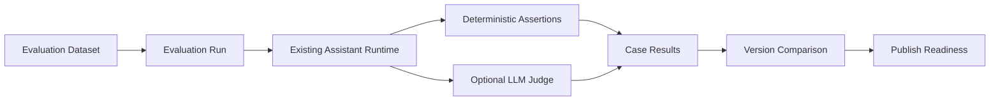

# ChatBot Factory

ChatBot Factory is a FastAPI backend with an Angular SSR frontend for building, publishing, and evaluating chatbot assistants.

## Public Repository Setup

Do not commit real credentials. Keep local and production secrets in environment variables, ignored `.env` files, Azure App Service application settings, or GitHub Secrets.

Backend:

```powershell
cd backend
copy .env.example .env.development
# Edit .env.development with local placeholder replacements only.
.\venv\Scripts\python.exe -m alembic upgrade head
.\venv\Scripts\uvicorn.exe main:app --reload
```

Frontend:

```powershell
cd frontend
copy .env.example .env
npm ci
npm run start
```

Required sensitive backend settings include `DATABASE_URL` or `POSTGRES_*`, `JWT_SECRET`, `SMTP_PASSWORD`, and `AZURE_OPENAI_API_KEY`. Browser-exposed frontend settings must contain only public URLs such as `PUBLIC_API_BASE_URL`, `PUBLIC_FRONTEND_BASE_URL`, `VITE_BACKEND_BASE_URL`, and `VITE_FRONTEND_BASE_URL`.

For Azure deployment, configure credentials through GitHub Secrets and Azure App Service application settings. Do not commit `.env`, publish profiles, private keys, database dumps, local uploads, or screenshots containing private data.

## Evaluation Center

The Evaluation Center measures whether an assistant version behaves well enough to publish. It is separate from Flow Test and the pre-publish smoke test: smoke tests check that the runtime works, while evaluations check answer quality, expected sources, flow path, latency and regressions.



### Domain Model

- `EvaluationDataset`: assistant-owned dataset containing ordered reusable cases.
- `EvaluationCase`: input message plus optional expected answer, source, flow, runtime and scoring criteria.
- `EvaluationCase.turns`: optional ordered messages for multi-turn flow paths such as button selection, name, email and phone collection.
- `EvaluationRun`: immutable version-specific run summary with score, counts, duration and dataset snapshot.
- `EvaluationCaseResult`: persisted evidence for one case, including response, sources, visited nodes, variables, assertions and sanitized errors.
- `EvaluationPolicy`: opt-in publish gate settings per assistant.

Historical runs store case and scoring snapshots, so editing a case later does not rewrite previous evidence.

### Supported Assertions

Deterministic assertions work without any extra AI model:

- non-empty response
- required keywords present
- forbidden keywords absent
- expected response mode
- required source document
- required source pattern
- minimum source count
- minimum retrieval score
- expected flow node visited
- forbidden flow node not visited
- expected final node
- variable equals value or exists
- maximum latency
- expected fallback
- expected handoff
- expected runtime failure category
- runtime completed without technical failure

### Scoring Rules

Scoring is centralized in `backend/services/evaluation_engine.py`.

- Every enabled assertion has equal default weight.
- Critical cases count double in run-level score.
- Case score is `0-100`.
- Passed: `80-100`.
- Warning: `60-79`.
- Failed: below `60` or failed critical assertion.
- Error: runtime could not be evaluated.

### Regression Rules

Comparisons are computed from two completed runs. A case is marked regressed when:

- previous status was passed and current status is warning, failed or error
- previous status was warning and current status is failed or error
- score decreases beyond the configured tolerance

The comparison response also reports fixed, improved, unchanged and non-comparable cases.

### Publish Gating

Evaluations are not mandatory globally. Enable them per assistant in the Evaluation Center policy.

Policy fields:

- evaluation required before publish
- required dataset
- minimum score
- maximum failed cases
- critical failures allowed
- block on regression
- maximum evaluation age

When enabled, the pre-publish checklist requires a completed evaluation run for the exact version being published. A run against `v2` does not approve `v3`.

### Running An Evaluation

1. Open an assistant.
2. Go to `Evaluations`.
3. Create a dataset.
4. Add cases with the expected answer/source/flow/runtime criteria you care about.
5. For flow assistants, use **Suggested flow edge cases** to generate cases from buttons, collection blocks, handoff blocks and terminal paths.
6. Select a version.
7. Run the dataset.
8. Inspect failed assertions, visual flow traces and compare against an older run when needed.

### Import And Export

JSON export preserves the complete supported structure:

```json
{
  "schema_version": 1,
  "dataset": {
    "name": "Customer Support Release Suite",
    "description": "Release checks"
  },
  "cases": []
}
```

CSV import/export supports a simpler subset. List fields use `|` as delimiter:

- `name`
- `input_message`
- `expected_keywords`
- `forbidden_keywords`
- `expected_sources`
- `maximum_latency_ms`
- `critical`
- `tags`

Imports validate every row before creating cases.

### Optional Judge

LLM-as-judge fields exist in the data model and UI, but judging is disabled by default in this MVP. Deterministic assertions remain the publish-gating source of truth. Judge failures must not erase deterministic results.

### Visual Flow Evaluation

The Evaluation Center reads the selected version's flow and can:

- show coverage by block
- suggest button path cases
- suggest invalid email and invalid phone cases
- suggest handoff and terminal path cases
- create multi-turn cases automatically
- display run traces over the flow map with expected, actual, missing and forbidden blocks

Managers do not need to type block IDs for common flow edge cases.

### Known Limitations

- Evaluation execution is synchronous for the MVP; status is still persisted.
- Multi-turn cases are supported for deterministic flow paths, but the UI still keeps advanced fields available for precise assertions.
- Regression publish blocking stores policy intent, but the initial readiness gate currently enforces exact-version score, failed-case and critical-failure thresholds.
- LLM-as-judge execution is not enabled yet.
